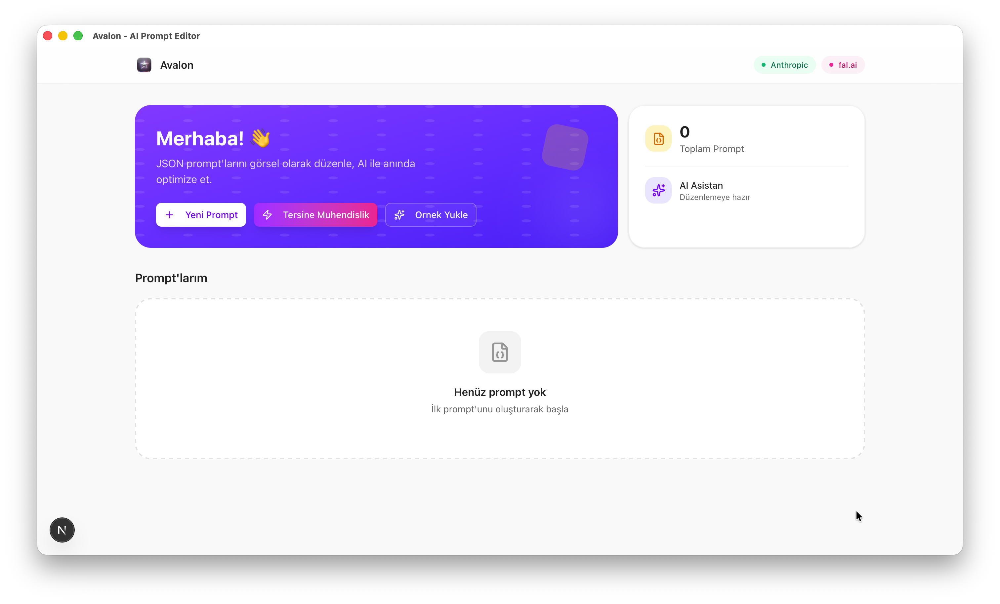
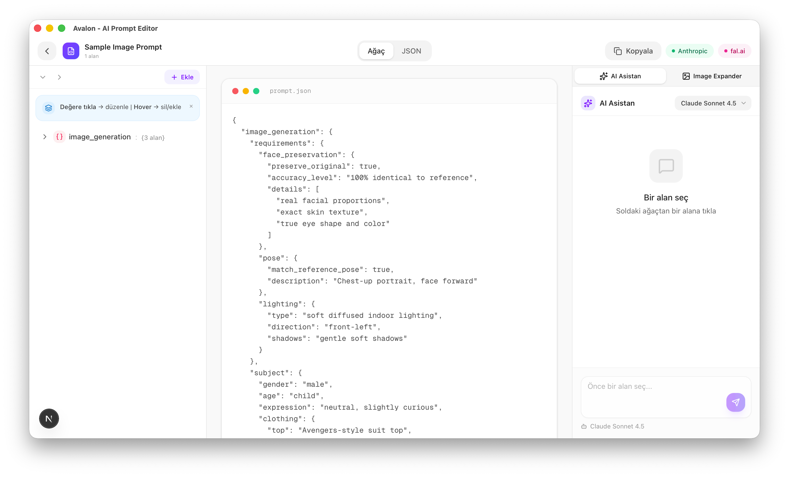
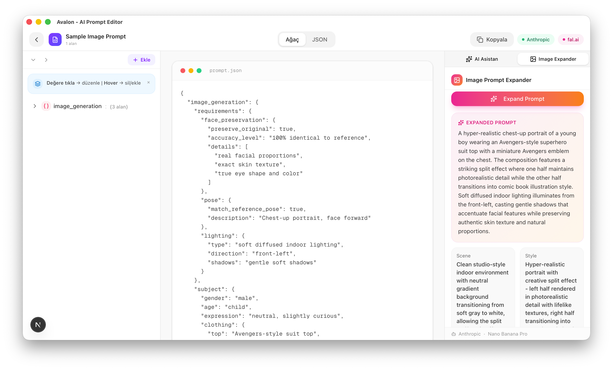
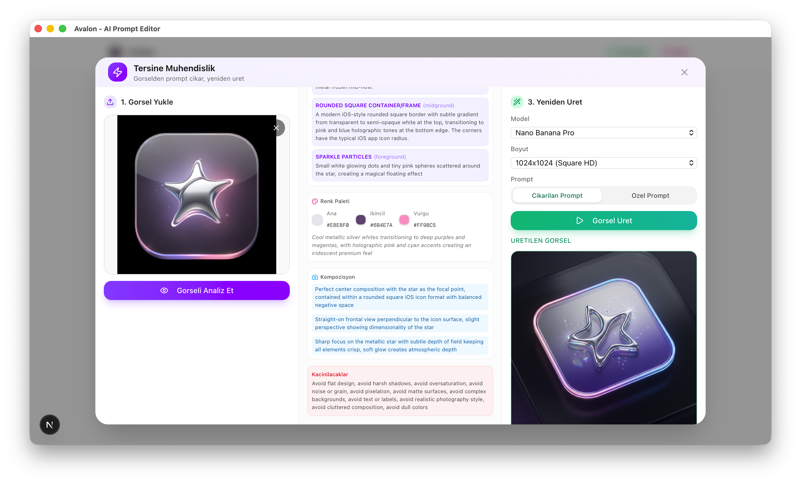

<p align="center">
  
</p>

<h1 align="center">Avalon</h1>

<p align="center">
  <strong>The AI-powered prompt editor for creators and developers</strong>
</p>

<p align="center">
  <a href="https://avalon.gunebakan.com">Live Demo</a> ·
  <a href="#features">Features</a> ·
  <a href="#getting-started">Getting Started</a> ·
  <a href="#supported-providers">Providers</a>
</p>

<p align="center">
  
  
  
  
</p>

---

## What is Avalon?

Avalon is a modern, visual JSON prompt editor that helps you create, edit, and optimize prompts for AI image generation and other AI tasks. With built-in AI assistance, you can expand simple prompts into detailed ones, reverse engineer prompts from images, and browse thousands of community prompts.

<p align="center">
  
</p>

## Features

### Visual JSON Editor
Edit complex JSON prompts with an intuitive tree view. No more wrestling with raw JSON - just click and edit any field.

<p align="center">
  
</p>

### AI-Powered Prompt Expansion
Turn simple ideas into detailed, production-ready prompts. Just describe what you want, and AI will generate a comprehensive prompt structure.

<p align="center">
  
</p>

### Reverse Engineering
Upload any image and let AI analyze it to extract the prompt that could recreate it. Perfect for learning from existing artwork.

<p align="center">
  
</p>

### Browse Community Prompts
Discover and import prompts from [prompts.chat](https://prompts.chat). Search by keyword, filter by type, and import with one click.

### Key Features

- **Visual Tree Editor** - Edit JSON prompts with a collapsible tree view
- **AI Assistant** - Get help editing any field with natural language
- **Prompt Expansion** - Transform simple prompts into detailed ones
- **Reverse Engineering** - Extract prompts from any image
- **Browse Prompts** - Search and import from prompts.chat
- **Multiple AI Providers** - OpenAI, Anthropic, Google Gemini
- **Image Generation** - Connect to fal.ai or Wiro.ai
- **PWA Support** - Install on mobile as a native app
- **Privacy First** - Your API keys never leave your device

## Supported Providers

### AI Services
| Provider | Models |
|----------|--------|
| **Anthropic** | Claude Sonnet 4, Claude Opus |
| **OpenAI** | GPT-4o, GPT-4 Turbo |
| **Google** | Gemini Pro, Gemini Flash |

### Image Generation
| Provider | Models |
|----------|--------|
| **fal.ai** | Flux, SDXL, and more |
| **Wiro.ai** | Nano Banana Pro |

## Getting Started

### Prerequisites

- Node.js 18+
- npm, yarn, or pnpm

### Installation

```bash
# Clone the repository
git clone https://github.com/radioheavy/avalon.git

# Navigate to the project
cd avalon

# Install dependencies
npm install

# Start the development server
npm run dev
```

Open [http://localhost:3000](http://localhost:3000) in your browser.

### First Run

1. **Choose an AI Provider** - Select OpenAI, Anthropic, or Google
2. **Enter your API Key** - Get one from your provider's dashboard
3. **Optional: Add Image Generation** - Connect fal.ai or Wiro.ai
4. **Start Creating!** - Create new prompts or browse existing ones

## Tech Stack

- **Framework**: [Next.js 16](https://nextjs.org/) with App Router
- **UI**: [React 19](https://react.dev/) + [Tailwind CSS 4](https://tailwindcss.com/)
- **Components**: [Radix UI](https://www.radix-ui.com/) primitives
- **State**: [Zustand](https://zustand-demo.pmnd.rs/)
- **Icons**: [Lucide React](https://lucide.dev/)
- **AI SDKs**: Anthropic, OpenAI (via API routes)

## Privacy & Security

Avalon takes your privacy seriously:

- **API keys are stored in sessionStorage** - They're cleared when you close the browser tab
- **No server-side storage** - We don't store any of your data on our servers
- **Direct API calls** - Your requests go directly to the AI providers
- **Open source** - Audit the code yourself

## Project Structure

```
avalon/
├── src/
│   ├── app/                 # Next.js app router
│   │   ├── api/            # API routes (proxy endpoints)
│   │   ├── globals.css     # Global styles
│   │   └── page.tsx        # Main application
│   ├── components/         # React components
│   │   ├── ai/            # AI panel components
│   │   ├── browse/        # Browse prompts components
│   │   ├── editor/        # Editor components
│   │   ├── image/         # Image-related components
│   │   └── ui/            # UI primitives
│   ├── lib/               # Utilities and store
│   └── types/             # TypeScript types
├── public/                # Static assets
└── package.json
```

## Scripts

```bash
npm run dev      # Start development server
npm run build    # Build for production
npm run start    # Start production server
npm run lint     # Run ESLint
```

## Contributing

Contributions are welcome! Please feel free to submit a Pull Request.

1. Fork the repository
2. Create your feature branch (`git checkout -b feature/amazing-feature`)
3. Commit your changes (`git commit -m 'Add amazing feature'`)
4. Push to the branch (`git push origin feature/amazing-feature`)
5. Open a Pull Request

## License

This project is licensed under the **Creative Commons Attribution-NonCommercial 4.0 International License (CC BY-NC 4.0)**.

You are free to share and adapt this work for non-commercial purposes with attribution. See the [LICENSE](LICENSE) file for details.

## Acknowledgments

- [prompts.chat](https://prompts.chat) for the MCP API integration
- [Radix UI](https://www.radix-ui.com/) for accessible components
- [Lucide](https://lucide.dev/) for beautiful icons

---

<p align="center">
  Made with ❤️ by <a href="https://x.com/dakmaybe">@dakmaybe</a>
</p>
